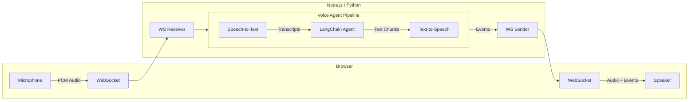

# Voice Sandwich Demo

A real-time, voice-to-voice AI pipeline demo featuring a sandwich shop order assistant. The Python backend in this workspace uses OpenAI for speech-to-text, the agent model, and text-to-speech. The TypeScript backend remains the original multi-provider reference implementation.

## Architecture

The pipeline processes audio through three transform stages using async generators:



### Pipeline Stages

Each stage is an async generator that transforms a stream of events:

1. **STT Stage** (`sttStream`): Transcribes incoming audio and yields transcription events (`stt_chunk`, `stt_output`)
2. **Agent Stage** (`agentStream`): Passes upstream events through, invokes the LangChain agent on final transcripts, and yields agent responses (`agent_chunk`, `tool_call`, `tool_result`, `agent_end`)
3. **TTS Stage** (`ttsStream`): Passes upstream events through, synthesizes agent text, and yields audio events (`tts_chunk`)

## Prerequisites

- **Node.js** (v18+) or **Python** (3.11+)
- **pnpm** or **uv** (Python package manager)

### API Keys

| Service | Environment Variable | Purpose |
|---------|----------------------|---------|
| OpenAI | `OPENAI_API_KEY` | Python backend agent, speech-to-text, and text-to-speech |
| AssemblyAI | `ASSEMBLYAI_API_KEY` | TypeScript backend speech-to-text |
| Cartesia | `CARTESIA_API_KEY` | TypeScript backend text-to-speech |
| Anthropic | `ANTHROPIC_API_KEY` | TypeScript backend LangChain agent |

## Quick Start

### Using Make

```bash
# Install all dependencies
make bootstrap

# Run TypeScript implementation (with hot reload)
make dev-ts

# Or run Python implementation (with hot reload)
make dev-py
```

The app will be available at `http://localhost:8000`

### Manual Setup

#### TypeScript

```bash
cd components/typescript
pnpm install
cd ../web
pnpm install && pnpm build
cd ../typescript
pnpm run server
```

#### Python

```bash
cd components/python
uv sync --dev
cd ../web
pnpm install && pnpm build
cd ../python
uv run src/main.py
```

## Project Structure

```text
components/
|-- web/                 # Svelte frontend (shared by both backends)
|   `-- src/
|-- typescript/          # Node.js backend
|   `-- src/
|       |-- index.ts     # Main server and pipeline
|       |-- assemblyai/  # AssemblyAI STT client
|       |-- cartesia/    # Cartesia TTS client
|       `-- elevenlabs/  # Alternate TTS client
`-- python/              # Python backend
    `-- src/
        |-- main.py      # Main server and pipeline
        |-- openai_stt.py
        |-- openai_tts.py
        |-- events.py
        `-- utils.py
```

## Event Types

The pipeline communicates via a unified event stream:

| Event | Direction | Description |
|-------|-----------|-------------|
| `stt_chunk` | STT -> Client | Partial transcription (real-time feedback) |
| `stt_output` | STT -> Agent | Final transcription |
| `agent_chunk` | Agent -> TTS | Text chunk from agent response |
| `tool_call` | Agent -> Client | Tool invocation |
| `tool_result` | Agent -> Client | Tool execution result |
| `agent_end` | Agent -> TTS | Signals end of agent turn |
| `tts_chunk` | TTS -> Client | Audio chunk for playback |
